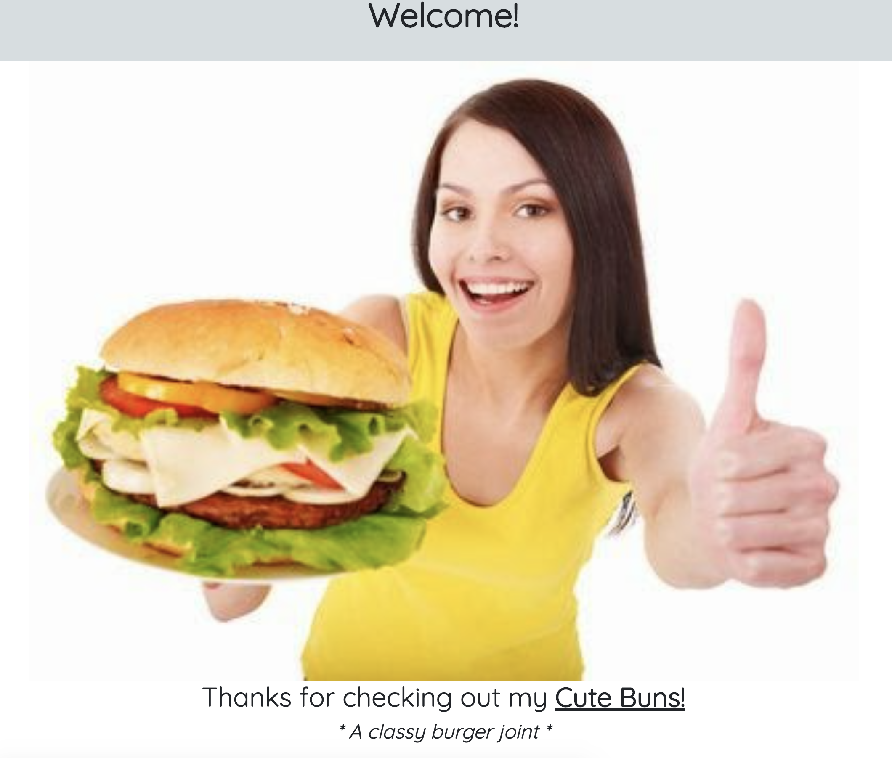
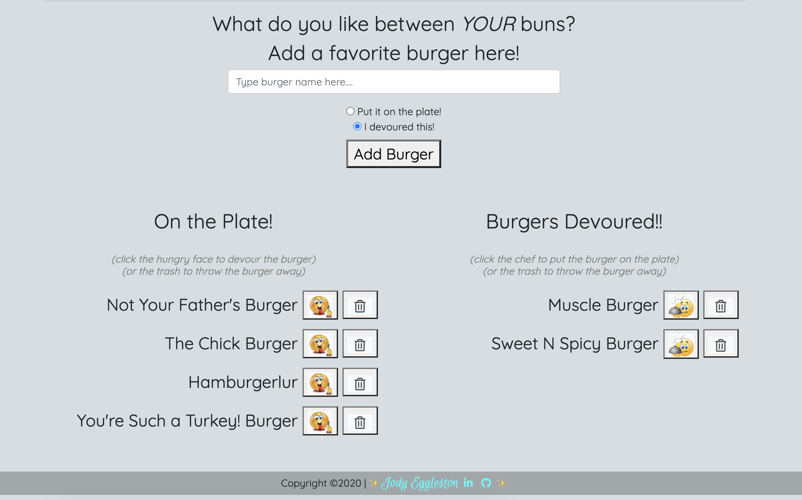
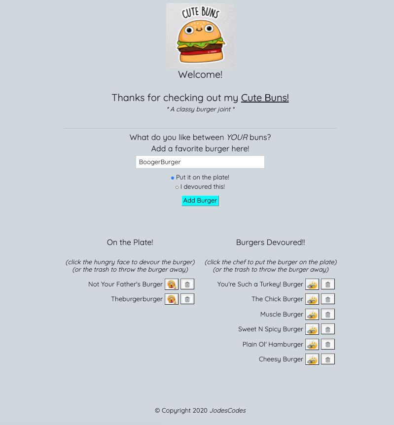
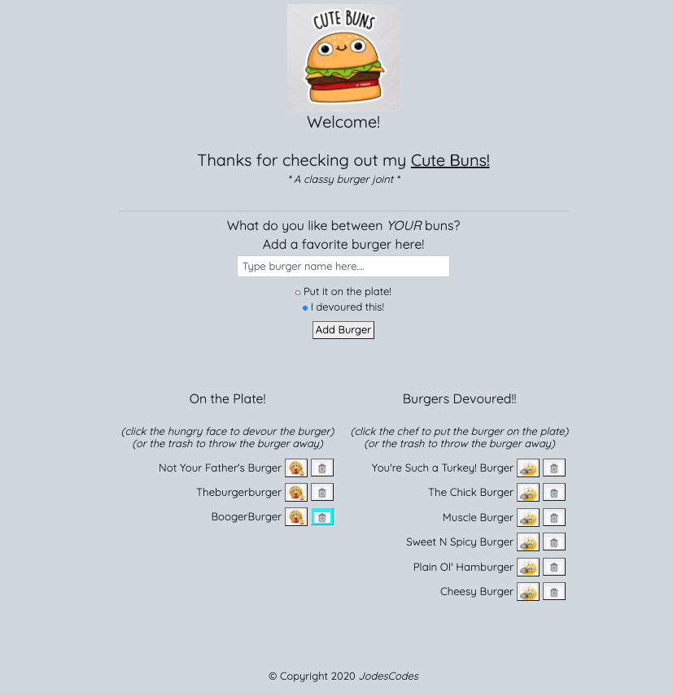

# Project Name  
  Eat Da Burger!  *aka Cute Buns! A classy burger joint.*

  ## Overview 
  A burger logger with MySQL, Node, Express, Handlebars and a homemade ORM. A simple menu style ordering with a side of humor.  

  ## Table of Contents:
  - [Links](#Links)
  - [Screenshots_and_GIFs](#Screenshots_and_GIFs)
  - [Motivation](#Motivation)
  - [Installation](#Installation)
  - [How_to_use](#How_to_use)
  - [Benefit](#Benefit)
  - [License](#License)
  - [Tests](#Tests)
  - [Contribute](#Contribute)

 ## Links
  - [Live on Heroku](https://eat-da-burger-cute-buns.herokuapp.com/)
  - [GitHub pages readme](https://jmeggles.github.io/Eat_Da_Burger/)
  - [View the code](https://github.com/jmeggles/Eat_Da_Burger)

 ## Screenshots_and_GIFs 
  - 
  -   
  - 
  -   
  - 
  
  ## Motivation
  It's a fun logger to showcase MVC with MySql, Node.Js, Handlebars, using DBeaver, Javascript, and CSS. 

  ## Installation 
   

  *Technology used*
    - node.js
    - Heroku
    - express (npm package)
    - express-handlebars (npm package)
    - Mysql (npm package)
    - DBeaver
    - Javascipt
    - CSS

  ## How_to_use
  Eat-Da-Burger! is a restaurant app that lets users input the names of burgers they'd like to eat.

  Clone repo from guthub and intall node modules, npm packages express, mysql, and express-handlebars inside project folder. Open DBeaver and use along with code to allow app to function proeperly and save information to the database for storage. Run node server.js in terminal to activate project. 

  Whenever a user submits a burger's name, your app will display the burger on the left, "On the Plate",  side of the page -- waiting to be devoured.  Each burger on the plate has a hungry-face emoji button ready to devour the burger. When the user clicks it, the burger will move to the right side of the page.  On the right, "Burgers Devoured", side of the page, the user can choose to put the burger back on the plate with the plate and utensils button.  Or if the user doesn't like the burger at all, they can toss it in the trash with the trashcan button on either side of the page. 

  Your app will store every burger in a database, whether devoured or not.

  ## Benefit
  Anyone can benefit from this project. It can be used to store order information for restaurants and stores or simply as a game just for fun.  

  ## License 
   
  [MIT License](https://opensource.org/licenses/MIT)

  Copyright © 2020 Jody Eggleston

  ## Credits
  Image from (http://www.davescottblog.com/wheres-amelia-islands-best-burger-is-it-main-beachs-putt-putt-t-rays-or/).

  ## Tests
  Testing was not done prior to start of project. However, DBeaver, console.log, and node server.js were used as each line of code was being built to ensure quaility along the process.

  ## Contact

  For comments and/or questions, contact Jody Eggleston via
  [Linkedin](https://www.linkedin.com/in/jody-eggleston/)